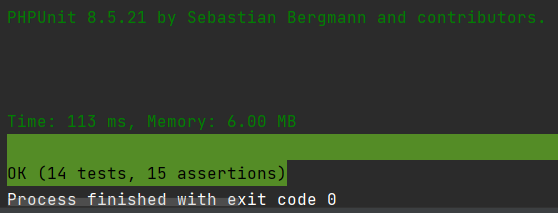

  <a href="#-projeto">Projeto</a>&nbsp;&nbsp;&nbsp;|&nbsp;&nbsp;&nbsp; 
  <a href="#-como-rodar">Como rodar</a>&nbsp;&nbsp;&nbsp;|&nbsp;&nbsp;&nbsp;
  <a href="#-como-contribuir">Como contribuir</a>&nbsp;&nbsp;&nbsp;
 

 

# Algarismo Romanos

## 🚀 Tecnologias

Esse projeto foi desenvolvido com as seguintes tecnologias:

- [PHP](https://www.php.net/) - 7.2
- [Composer](https://getcomposer.org/) - v1.8.4
- [Apache](https://www.apache.org/) 2.4.35

## 💻 Projeto

Projeto com testes para converter numeros arabicos em algarismos romanos e o inverso. 

- Teste passando.

  

## 🚀 Como Rodar

- Clone o projeto.
- Entre na pasta do projeto e rode "composer install".
- php -S localhost:8000 -t public/
- Executar o comando ".\vendor\bin\phpunit" para rodar os testes(precisa ta na rais do projeto).

## Licença

O framework Laravel e esse projeto usam a linceça [MIT license](https://opensource.org/licenses/MIT).
